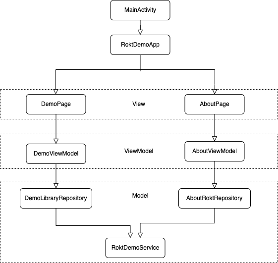

# rokt-demo-android

Rokt Demo application is a sample app built to showcase Rokt mobile SDK functionality. The purpose of this app is to showcase the functionality that Rokt provides in-app. The app features multiple pages with different placement examples to demonstrate the functionality of the Rokt mobile SDK.

## Resident Experts
- Thomson Thomas - thomson.thomas@rokt.com
- James Newman - james.newman@rokt.com


| Environment | Build |
| ----------- | :----- |
| release |  [](https://buildkite.com/rokt/rokt-demo-android)

## Requirements

The latest version of Android Studio is required. Follow [these instructions](https://developer.android.com/studio/install) to install or alternatively on Mac using [brew](https://brew.sh/):  

`brew install --cask android-studio`  

The project is configured to run on Android API 21 and above and compiled against API 31.

## How to build and run Locally?
1. Open Android Studio
2. Open the project by selecting the project folder
3. Wait for Gradle sync to finish (this could take a while the first time)
4. Select a [physical device](https://developer.android.com/studio/run/device) or [virtual device](https://developer.android.com/studio/run/emulator) from the dropdown
5. Click the green run button

## How to run local tests?
To run all tests, select the `rokt-demo-android [test]` run configuration and click the green run button.  
If you can't find this configuration then you can run all the tests via the command line using  

`./gradlew test`.

## How to preview layouts on emulator

To preview Rokt layouts on an Android emulator:

1. In OnePlatform, use the layout preview option for mobile layouts to generate a QR code
2. The demo app can process this QR code data through a deeplink
3. To trigger the preview, use the following adb command format:
   ```bash
   adb shell am start -a android.intent.action.VIEW -d "rokt://demo/preview?config=<URL_ENCODED_JSON>"
   ```
   Where `<URL_ENCODED_JSON>` is the URL-encoded JSON data from the QR code

Example command:
```bash
adb shell am start -a android.intent.action.VIEW -d "rokt://demo/preview?config=%7B%22tagId%22%3A%222754655826098840951%22%2C%22previewId%22%3A%223435870199391584257%22%2C%22versionId%22%3A%221746660670465%22%2C%22creativeIds%22%3A%5B%223335250570341581807%22%2C%223341268103002062853%22%2C%223334226469759813591%22%2C%223334285963646863068%22%5D%2C%22language%22%3A%22en%22%2C%22layoutVariantIds%22%3A%5B%223435870199391584258%22%5D%7D"
```

Note: The deeplink URL is constructed by combining the prefix `rokt://demo/preview?config=` with the URL-encoded JSON data from the QR code. Ref: https://github.com/ROKT/rokt-demo-android/pull/82

## CI/CD System

**Buildkite** is used as the CI system https://buildkite.com/rokt/rokt-demo-android.
Buildkite pipelines are defined in `.buildkite` directory.
It uses **docker** container for executing the build steps using the **Fastlane** build tool.
The docker image used for this version installs Java 11, and Android SDK version 30.

It can be found here: https://github.com/NedaRobatMeily/docker-image-java-11

## How to release the app
- Update build `versionCode` and `versionNumber` in build.gradle file
- Commit & push
- Unblock the release step on **Buildkite**
- On google play console, under releases section, add release note and publish the version

## Automated Publishing
The SDK can be released via the [Mobile Release Pipeline](https://github.com/ROKT/mobile-release-pipeline). Follow the instructions in the Mobile Release Pipeline repo to release. You can still release the SDK manually by following the steps in the previous section.  

## Project architecture

This project is implemented based on the MVVM and repository patterns. 

MVVM (Model-View-ViewModel) is an architectural pattern that serves to separate user interface logic from business/program logic.  
- The Model layer provides the business logic of the application. In this case, it consists of multiple repositories that expose data sources to the ViewModel.
- The View layer consists of the UI elements that the user interacts with, which are represented by composable elements in this project.  
- The ViewModel layer connects the Model and View layers. It transforms data from the Model layer and stores the UI state that is accessed by the View layer.  

For example, when the user interacts with the View layer via the UI elements, events are sent to the ViewModel layer. Based on these events, the ViewModel can then access data from the Model layer through the repositories. Using this data, the ViewModel can update the UI state. As the View is observing this UI state, it can then automatically update the UI elements once the ViewModel changes the state. 

This separation of responsibility between the three layers ultimately simplifies the project architecture and improves testability by reducing coupling.



### Project structure

This project contains data, di, model, ui, and utils packages.  

data: contains repositories that expose data from network operations performed by RoktDemoService.  
di: for dependency injection.  
model: contains data classes that model data.  
ui: contains the View and ViewModels  
utils: contains shared utility functions used throughout the application

## Rokt SDK logic

**MainActivityViewModel** contains an observable selectedTagId which is set from other pages in the application. The selectedTagId is observed in the MainActivity, where Rokt.Init() is called every time the tagId value is changed.
This is because our application is a single Activity application, and Rokt.init requires an Activity to be passed in.
All other Rokt SDK related calls happen in **RoktExecutor**.

## FAQ

### How can I use mock data?
In the ApplicationModule, change provideDemoRepository to return DemoLibraryRepositoryMockImpl and provideAboutRoktRepository to return AboutRoktRepositoryMockImpl.

### Where are dependencies defined?
They are defined under buildSrc/dependencies. For more information on kotlin_dsl visit: https://docs.gradle.org/current/userguide/kotlin_dsl.html

## License
```
Copyright 2020 Rokt Pte Ltd

Licensed under the Rokt Software Development Kit (SDK) Terms of Use
Version 2.0 (the "License");

You may not use this file except in compliance with the License.

You may obtain a copy of the License at https://rokt.com/sdk-license-2-0/
```